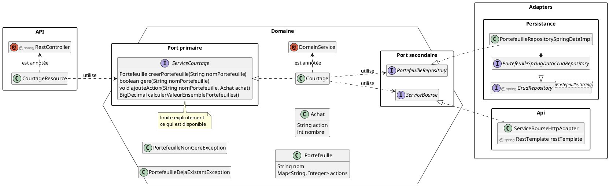
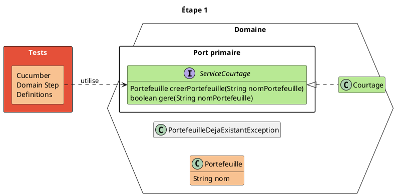
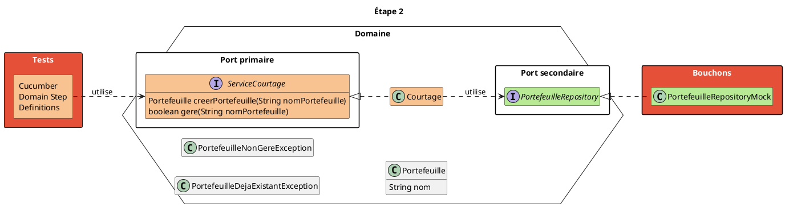
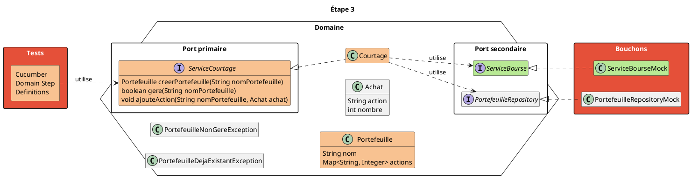
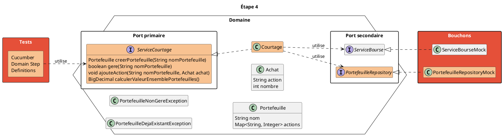
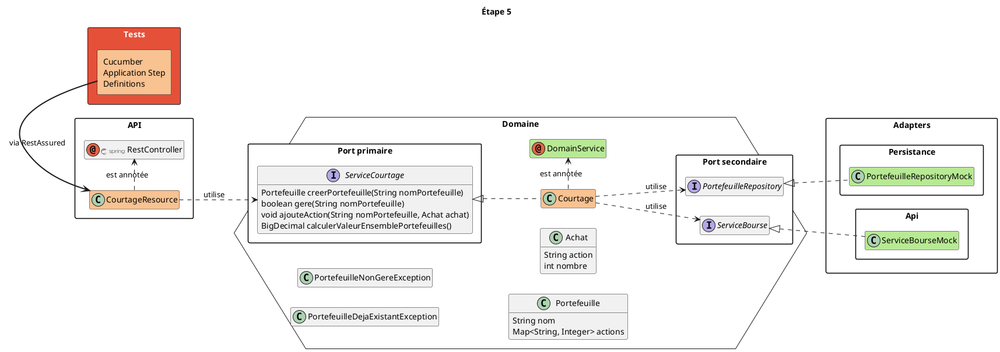
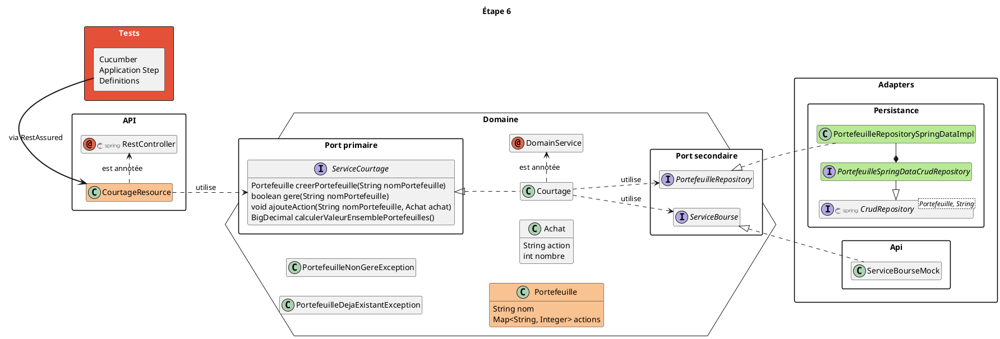
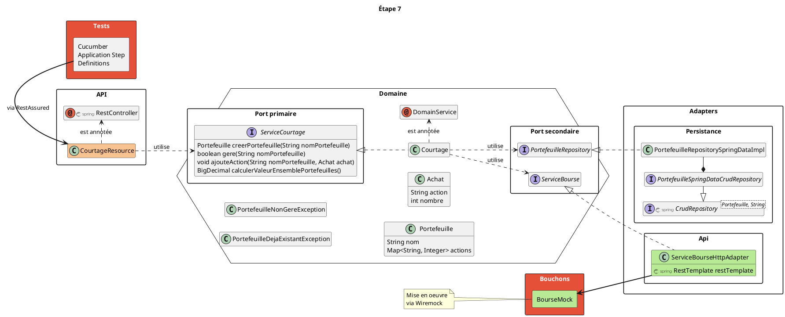
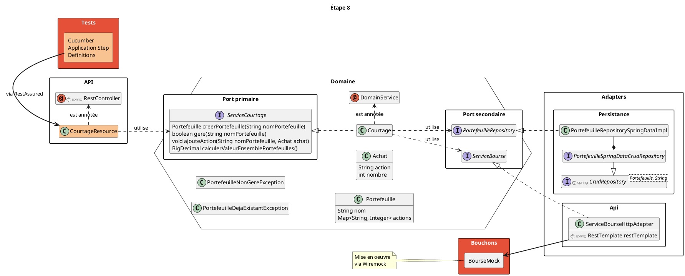

# Lab - Architecture Hexagonale

---

## Préparation

**☛ <u>à faire impérativement AVANT le Lab !!!</u> ☚**

Pour améliorer au maximum votre confort dans le déroulement de ce lab :<br/>
effectuer les actions suivantes **avant** le début du lab<br/>
... de préférence chez vous<br/>
(avec une bonne connexion internet)

```bash
git clone https://github.com/javathought/lab-archi-hexa
cd devoxx-lab-architecture-hexagonale
git switch main && ./mvnw dependency:go-offline
```

----

## Prérequis pour ce lab

* Connaitre le langage Java
* Avoir des bases dans l'usage de Git, Maven, Cucumber
* Avoir un JDK (Java >= 11)
* Avoir un IDE

----

## Envie de se familiariser avec les concepts avant ?

- [Pérennisez votre métier avec l’architecture hexagonale <small>(Publicis Sapiens - ex: Xebia)</small>](https://blog.xebia.fr/2016/03/16/perennisez-votre-metier-avec-larchitecture-hexagonale/)
- [Architecture Hexagonale : trois principes et un exemple d’implémentation <small>(Octo)</small>](https://blog.octo.com/architecture-hexagonale-trois-principes-et-un-exemple-dimplementation/)
- [Architecture hexagonale pour les nuls <small>(Y. Chéné - Devoxx FR 2018)</small>](https://www.youtube.com/watch?v=Hi5aDfRe-aE)
- [Architecture hexagonale <small>(Eleven Labs)</small>](https://blog.eleven-labs.com/fr/architecture-hexagonale/)

Note: **Autres ressources**

- [DDD, Hexagonal, Onion, Clean, CQRS, … How I put it all together](https://herbertograca.com/2017/11/16/explicit-architecture-01-ddd-hexagonal-onion-clean-cqrs-how-i-put-it-all-together/)
- [WikiBooks - Java Persistence/ElementCollection - Example of a ElementCollection relationship to a basic value XML](https://en.wikibooks.org/wiki/Java_Persistence/ElementCollection#Example_of_a_ElementCollection_relationship_to_a_basic_value_XML)

---

## Vos "accompagnateurs" pour ce lab ...

<table>
<tr>
	<th scope="col" style="text-align:center">Pascal</th>
	<th scope="col" style="text-align:center">JY</th>
</tr>
<tr>
	<td></td>
	<td></td>
</tr>
</table>

---

## Objectifs

Développer un petit système de courtage boursier

→ en s'appuyant sur une<br/>
**architecture applicative hexagonale**

---

## Architecture hexagonale

Qu'est-ce que c'est ?

*Commençons par un peu de théorie ...*

----

## Quels sont les enjeux

* S'adapter à l'obsolescence technologique
* Avoir un feedback ultra rapide

Note:

* Obsolescence technologique :
	* Choisir les frameworks le plus tard possible
	* Changer de frameworks sans toucher au métier
* Feedback de dev :
	* Pas besoin de démarrer toute la stack pour tester le métier

----

## Différentes orientations


Note: Les principes de "Clean Architecture" → Le domaine métier : au centre

---

## Organisation du lab

... en plusieurs étapes jusqu'à la solution finale :



----

### Pour chaque étape ...

Vous aurez :

* de nom de tag Git<br/>
  <small>partir de laquelle vous pourrez créer une branche pour vos développements</small>
* les exigences à couvrir<br/>
  <small>sous forme de scénarios écrit en langage [Gherkin](https://cucumber.io/docs/gherkin/)</small>

----

### La structure de base du projet ...

comporte :

* une chaine de build Maven
* une mise en place de Cucumber<br/>
  <small>avec un embryon de "glue" pour faciliter l'exécution des exigences</small>

---

## Étape 1 : objectif

Mise en place du _métier de l'application_<br/>
**sans intégrer de framework technique**

> *Un service de courtage gére une liste de portefeuille*

* Code à créer dans le module :<br/>
  `courtage-domain`

----

## Nouvelles exigences à couvrir

<div style="font-size:0.8em">

```gherkin
Scénario: Récupération de l'identifiant d'un portefeuille
	Quand on demande au service de courtage la création du portefeuille "FOO-1"
	Alors l'id du portefeuille créé doit être "FOO-1"

Scénario: Récupération de l'identifiant d'un autre portefeuille
	Quand on demande au service de courtage la création du portefeuille "BAR-2"
	Alors l'id du portefeuille créé doit être "BAR-2"

Scénario: Ajout d'un portefeuille et vérification de la présence du portefeuille
	Quand on demande au service de courtage la création du portefeuille "FOO-3"
	Alors le portefeuille "FOO-3" est géré par le service de courtage

Scénario: Création de 2 portefeuilles et vérification de la présence de ces 2 portefeuilles
	Quand on demande au service de courtage la création du portefeuille "FOO-4"
	Et qu'on demande au service de courtage la création du portefeuille "BAR-4"
	Alors le portefeuille "FOO-4" est géré par le service de courtage
	Et le portefeuille "BAR-4" est géré par le service de courtage
```

</div>

----



----

Point de départ :

```bash
git stash && git switch -c dev-etape-1 etape-1
```

Point d'arrivée :

```bash
# La commande suivante doit terminer en 'BUILD SUCCESS'
./mvnw clean verify -pl courtage-domain -am -Dcucumber.filter.tags="@E1"
```

---

## Étape 2

* Mise en oeuvre du *PortefeuilleRepository*
* Création d'un bouchon<br/>
  <small>(une implémentation basée sur `HashMap`, dans les packages de test, suffira)</small>

----

## Nouvelles exigences à couvrir

<div style="font-size:0.8em">

```gherkin
Scénario: Ajout d'un portefeuille et vérification de la non présence du portefeuille
	Quand on demande au service de courtage la création du portefeuille "FOO-6"
	Alors le portefeuille "INCONNU" n'est pas géré par le service de courtage

Scénario: Un portefeuille doit être unique pour un service de courtage
	Quand on demande au service de courtage la création du portefeuille "FOO-7"
	Et qu'on demande au service de courtage la création du portefeuille "FOO-7"
	Alors une exception est levée : Portefeuille déjà géré

Scénario: Calcul de la valeur d'un portefeuille vide
	Quand on demande au service de courtage la création du portefeuille "FOO-8"
	Et qu'on demande le calcul de la valeur du portefeuille "FOO-8"
	Alors la valeur du portefeuille est 0,0

Scénario: Calcul de la valeur d'un portefeuille non géré
	Quand on demande au service de courtage la création du portefeuille "FOO-9"
	Et qu'on demande le calcul de la valeur du portefeuille "INCONNU"
	Alors une exception est levée : Portefeuille non géré
```

</div>

----



----

Point de départ (facultatif) :

```bash
git stash && git switch -c dev-etape-2 etape-2
```

Point d'arrivée :

```bash
# La commande suivante doit terminer en 'BUILD SUCCESS'
./mvnw clean verify -pl courtage-domain -am -Dcucumber.filter.tags="@E2"
```

---

## Étape 3

* Ajout de la gestion des actions au domaine métier
* Mise en place d'un bouchon pour la bourse

----

## Nouvelles exigences à couvrir

<div style="font-size:0.6em">

```gherkin
Scénario: Récupération par le service de bourse de la valeur d'une action
	Soit les cours de bourse suivants :
		| Action | Valeur |
		| TEST   | 0,1    |
	Quand on demande au service de bourse la valeur de l'action "TEST"
	Alors la valeur récupérée pour l'action est 0,1

Scénario: Calcul de la valeur d'un portefeuille avec une action
	Soit les cours de bourse suivants :
		| Action | Valeur |
		| TEST   | 0,1    |
	Quand on demande au service de courtage la création du portefeuille "FOO-10"
	Et qu'on demande au service de courtage d'ajouter l'action suivante :
		| Portefeuille | Action | Nombre |
		| FOO-10       | TEST   | 1      |
	Et qu'on demande le calcul de la valeur du portefeuille "FOO-10"
	Alors la valeur du portefeuille est 0,1

Scénario: Ajout d'une action à un portefeuille inexistant
	Quand on demande au service de courtage d'ajouter l'action suivante :
		| Portefeuille | Action | Nombre |
		| INCONNU      | TEST   | 1      |
	Alors une exception est levée : Portefeuille non géré

Scénario: Calcul de la valeur d'un portefeuille avec deux action
	Soit les cours de bourse suivants :
		| Action | Valeur |
		| TEST   | 0,1    |
	Quand on demande au service de courtage la création du portefeuille "FOO-11"
	Et qu'on demande au service de courtage d'ajouter l'action suivante :
		| Portefeuille | Action | Nombre |
		| FOO-11       | TEST   | 2      |
	Et qu'on demande le calcul de la valeur du portefeuille "FOO-11"
	Alors la valeur du portefeuille est 0,2

Scénario: Calcul de la valeur d'un portefeuille avec deux actions au cours de 0,2
	Soit les cours de bourse suivants :
		| Action | Valeur |
		| TEST   | 0,2    |
	Quand on demande au service de courtage la création du portefeuille "FOO-12"
	Et qu'on demande au service de courtage d'ajouter l'action suivante :
		| Portefeuille | Action | Nombre |
		| FOO-12       | TEST   | 2      |
	Et qu'on demande le calcul de la valeur du portefeuille "FOO-12"
	Alors la valeur du portefeuille est 0,4

Scénario: Calcul de la valeur d'un portefeuille avec deux actions différentes
	Soit les cours de bourse suivants :
		| Action | Valeur |
		| CA     | 0,2    |
		| SG     | 0,7    |
	Quand on demande au service de courtage la création du portefeuille "FOO-13"
	Et qu'on demande au service de courtage d'ajouter les actions suivantes :
		| Portefeuille | Action | Nombre |
		| FOO-13       | CA     | 2      |
		| FOO-13       | SG     | 4      |
	Et qu'on demande le calcul de la valeur du portefeuille "FOO-13"
	Alors la valeur du portefeuille est 3,2

Scénario: Calcul de la valeur d'un portefeuille en ajoutant 2 actions au même titre
	Soit les cours de bourse suivants :
		| Action | Valeur |
		| CA     | 0,2    |
	Quand on demande au service de courtage la création du portefeuille "FOO-14"
	Et qu'on demande au service de courtage d'ajouter les actions suivantes :
		| Portefeuille | Action | Nombre |
		| FOO-14       | CA     | 2      |
		| FOO-14       | CA     | 4      |
	Et qu'on demande le calcul de la valeur du portefeuille "FOO-14"
	Alors la valeur du portefeuille est 1,2
```

</div>

----



----

Point de départ (facultatif) :

```bash
git stash && git switch -c dev-etape-3 etape-3
```

Point d'arrivée :

```bash
# La commande suivante doit terminer en 'BUILD SUCCESS'
./mvnw clean verify -pl courtage-domain -am -Dcucumber.filter.tags="@E3"
```

---

## Étape 4

* enrichissement du domaine métier
* enrichissement du bouchon Bourse

----

## Nouvelles exigences à couvrir

<div style="font-size:0.6em">

```gherkin
Scénario: Calcul de la valeur de plusieurs portefeuilles non vides
	Soit les cours de bourse suivants :
		| Action | Valeur |
		| CA     | 0,2    |
		| SG     | 0,5    |
	Quand on demande au service de courtage la création du portefeuille "myCard"
	Et qu'on demande au service de courtage la création du portefeuille "eWallet"
	Et qu'on demande au service de courtage d'ajouter les actions suivantes :
		| Portefeuille | Action | Nombre |
		| myCard       | CA     | 2      |
		| myCard       | SG     | 4      |
		| eWallet      | CA     | 6      |
		| eWallet      | SG     | 5      |
	Et qu'on demande au service de courtage le calcul de la valeur de tous les portefeuilles
	Alors la valeur pour l'ensemble des portefeuilles est 6,1

Scénario: Calcul de la valeur des actions sans portefeuille
	Quand on demande au service de courtage le calcul de la valeur de tous les portefeuilles
	Alors la valeur pour l'ensemble des portefeuilles est 0,0

Scénario: Calcul de la valeur d'un portefeuille en ajoutant 2 actions au même titre
	Soit les cours de bourse suivants :
		| Action | Valeur |
		| CA     | 0,2    |
	Quand on demande au service de courtage la création du portefeuille "TOTO"
	Et qu'on demande au service de courtage d'ajouter l'action suivante :
		| Portefeuille | Action | Nombre |
		| TOTO         | CA     | 2      |
	Et qu'on demande le calcul de la valeur du portefeuille "TOTO"
	Alors la valeur du portefeuille est 0,4
	Quand les cours de bourse sont :
		| Action | Valeur |
		| CA     | 0,4    |
	Et qu'on demande le calcul de la valeur du portefeuille "TOTO"
	Alors la valeur du portefeuille est 0,8

Scénario: Calcul de la valeur d'un portefeuille inconnu
	Quand on demande le calcul de la valeur du portefeuille "INCONNU"
	Alors une exception est levée : Portefeuille non géré

Scénario: La valeur totale du portefeuille doit être correctement recalculée si le cours des actions changent
	Soit les cours de bourse suivants :
		| Action | Valeur |
		| CA     | 0,2    |
		| SG     | 0,5    |
	Quand on demande au service de courtage la création du portefeuille "myCard"
	Et qu'on demande au service de courtage la création du portefeuille "eWallet"
	Et qu'on demande au service de courtage d'ajouter les actions suivantes :
		| Portefeuille | Action | Nombre |
		| myCard       | CA     | 2      |
		| myCard       | SG     | 4      |
		| eWallet      | CA     | 6      |
		| eWallet      | SG     | 5      |
	Et qu'on demande au service de courtage le calcul de la valeur de tous les portefeuilles
	Alors la valeur pour l'ensemble des portefeuilles est 6,1
	Mais si les cours de bourse deviennent :
		| Action | Valeur |
		| CA     | 1,1    |
		| SG     | 0,7    |
	Et qu'on demande au service de courtage le calcul de la valeur de tous les portefeuilles
	Alors la valeur pour l'ensemble des portefeuilles est 15,1
```

</div>

----



----

Point de départ (facultatif) :

```bash
git stash && git switch -c dev-etape-4 etape-4
```

Point d'arrivée :

```bash
# La commande suivante doit terminer en 'BUILD SUCCESS'
./mvnw clean verify -pl courtage-domain -am -Dcucumber.filter.tags="@E4"
```

---

## Pause

---

## Étape 5

services métier via API REST<br/>
**... sans modifier le code métier**

* module `courtage-application-springboot`
	* avec un 1er service REST :<br/>
	  `/courtage/version`
	* UI pour tester les APIs REST :<br/>
	  <smal><a href="http://localhost:8081/swagger-ui.html">http://localhost:8081/swagger-ui.html</a></small>

----

### À developer :

* Création d'un portefeuille :<br/>
  `POST /courtage/portefeuilles/{nom}`
* Vérification de l'existance d'un portefeuille :<br/>
  `GET /courtage/portefeuilles/{nom}`

----



----

### Injection de dépendances

Pour caractériser les services du domaine métier, création d'une annotation :

```java

@Target({ElementType.TYPE})
@Retention(value = RetentionPolicy.RUNTIME)
public @interface DomainService {
}
```

Pour indiquer à Spring de les prendre en compte :

```java
@ComponentScan(
	basePackageClasses = {
		CourtageSpringbootApplication.class,
		DomainService.class
	},
	includeFilters = {@ComponentScan.Filter(
		value = {DomainService.class},
		type = FilterType.ANNOTATION
	)}
)
```

----

Point de départ :

```bash
git stash && git switch -c dev-etape-5 etape-5
```

Point d'arrivée :

```bash
# La commande suivante doit terminer en 'BUILD SUCCESS'
./mvnw clean verify -Dcucumber.filter.tags="@E5"
```

---

## Étape 6

* Persistence des données en base<br/>
  ➥ gérée dans une base H2
* Calcul de la valorisation d'un portefeuille :<br/>
  `GET /courtage/portefeuilles/{nom}/valorisation`
* Achat d'actions dans un portefeuille :<br/>
  `POST /courtage/portefeuilles/{nom}/actions`

----



----

Point de départ (facultatif) :

```bash
git stash && git switch -c dev-etape-6 etape-6
```

Point d'arrivée :

```bash
# La commande suivante doit terminer en 'BUILD SUCCESS'
./mvnw clean verify -Dcucumber.filter.tags="@E6"
```

---

## Étape 7

* Appel HTTP pour la bourse
* Enrichissement des API REST :
	* Restitution des positions d'un portefeuille :<br/>
	  `GET /courtage/portefeuilles/{nom}/positions`
	* Calcul de valorisation des portefeuilles gérés :<br/>
	  `GET /courtage/avoirs`

----

#### Service externe : cours de bourse

* Requête :<br/>
  <code>GET https:// … /finance/quote/{action}</code>

* Exemple de réponse pour<br/>
  `https:// … /finance/quote/CA` :

```json
{
	"symbol": "CA",
	"regularMarketPrice": 1.795
}
```

➥ Service simulé avec Wiremock

----



----

Point de départ (facultatif) :

```bash
git stash && git switch -c dev-etape-7 etape-7
```

Point d'arrivée :

```bash
# La commande suivante doit terminer en 'BUILD SUCCESS'
./mvnw clean verify -Dcucumber.filter.tags="@E7"
```

---

## Étape 8

* Validation de la cohérence fonctionnelle des objets du domaine

----



----

Point de départ (facultatif) :

```bash
git stash && git switch -c dev-etape-8 etape-8
```

Point d'arrivée :

```bash
# La commande suivante doit terminer en 'BUILD SUCCESS'
./mvnw clean verify -Dcucumber.filter.tags="@E8"
```

---

## Conclusion

Nous avons vu :

* mettre en œuvre une "clean architecture" (suivant les principes de l'architecture hexagonale)
* la gestion de la persistance avec Spring
* la validation de la cohérence fonctionnelle des objets du domaine
